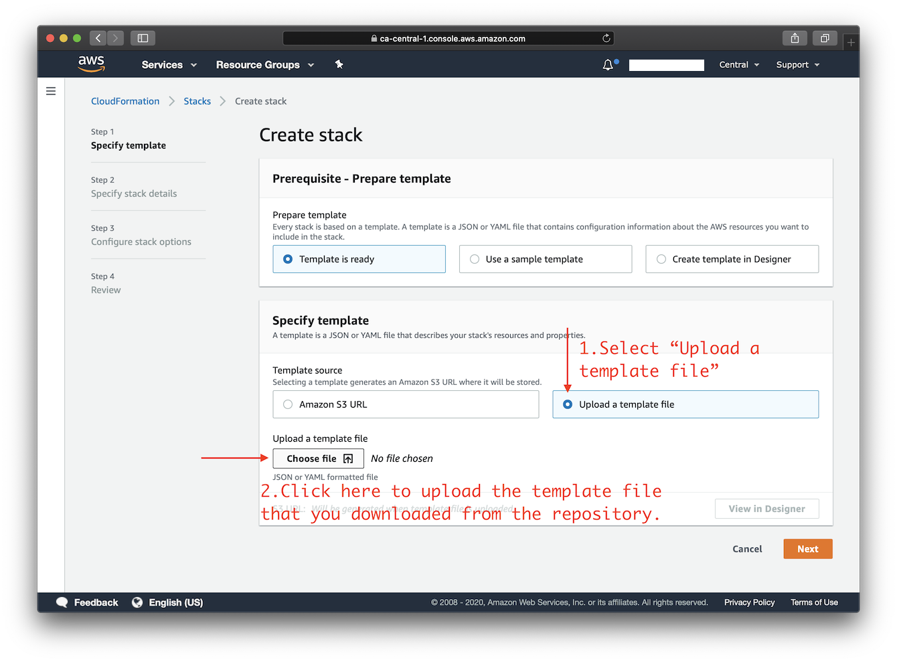
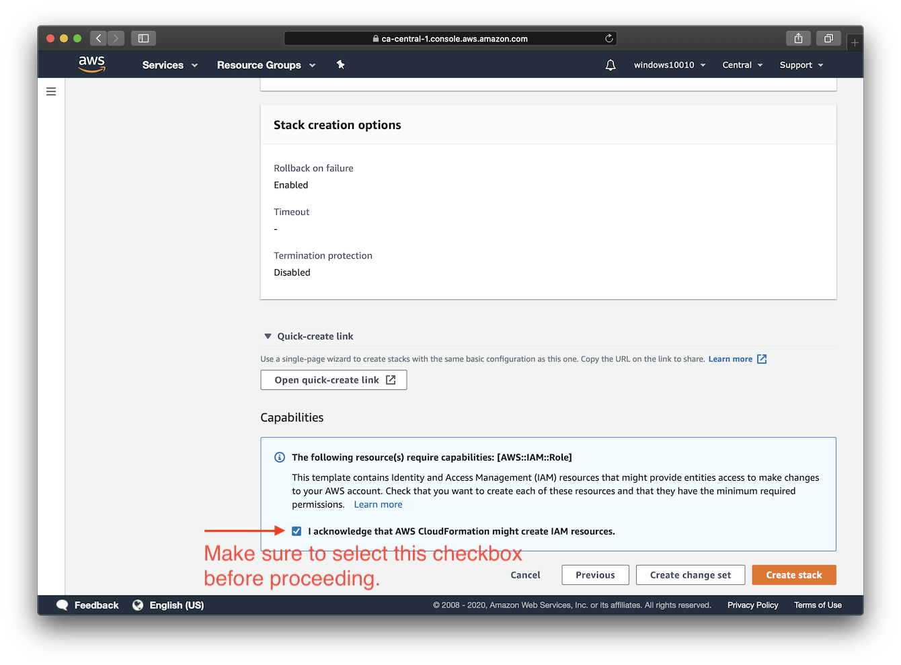
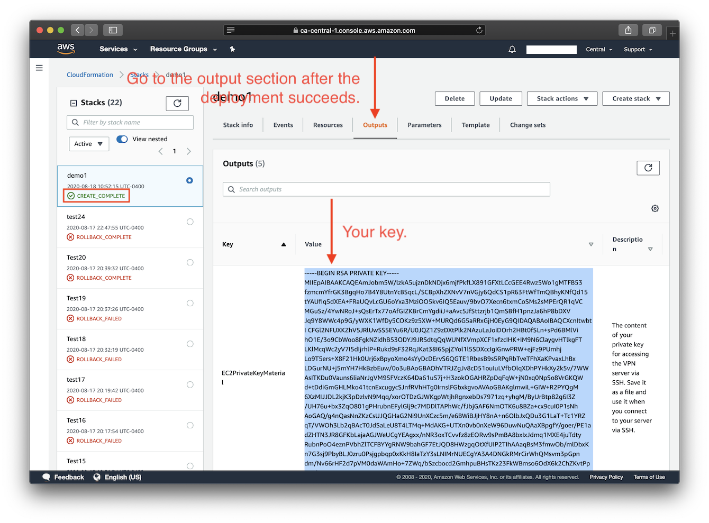
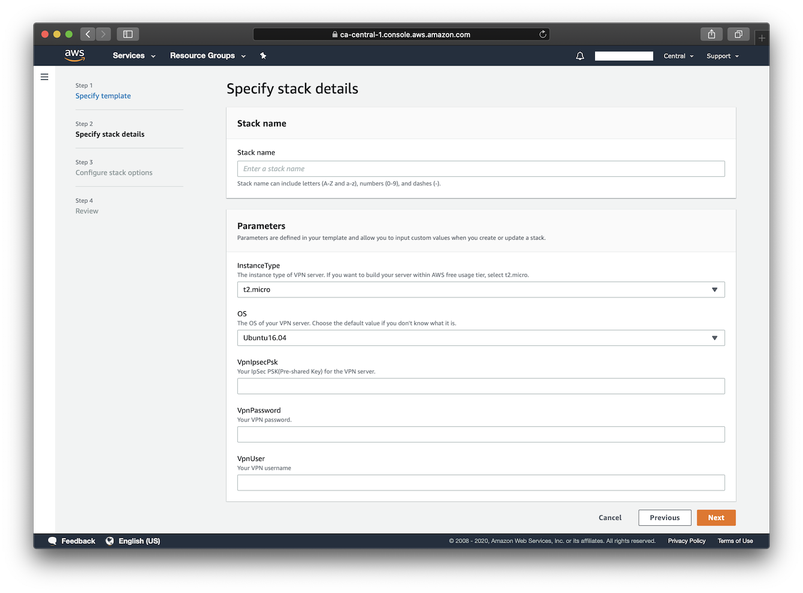

# 使用 CloudFormation 在 Amazon EC2 上部署

*其他语言版本: [English](README.md), [简体中文](README-zh.md).*

使用这个模板，你可以在 Amazon Elastic Compute Cloud（Amazon EC2）上快速搭建一个 IPsec VPN 服务器。在继续之前，请参见 EC2 [定价细节](https://aws.amazon.com/cn/ec2/pricing/on-demand/)。在部署中使用 `t2.micro` 服务器实例可能符合 [AWS 免费套餐](https://aws.amazon.com/cn/free/) 的资格。

可用的自定义参数：

- Amazon EC2 实例类型
> **注：** 在某些 AWS 区域中，此模版提供的某些实例类型可能不可用。比如 `m5a.large` 可能无法在 `ap-east-1` 区域部署（仅为假设）。在此情况下，你会在部署过程中遇到此错误：`The requested configuration is currently not supported. Please check the documentation for supported configurations`。新开放的 AWS 区域更容易出现此问题，因为它们提供的实例类型较少。如需了解更多关于实例可用性的信息，请参见 [https://ec2instances.info](https://ec2instances.info)。
- VPN 服务器的操作系统（Ubuntu 20.04/18.04, Debian 9, CentOS 8/7, Amazon Linux 2）
> **注：** 在 EC2 上使用 Debian 9 映像之前，你需要先在 AWS Marketplace 上订阅：[Debian 9](https://aws.amazon.com/marketplace/pp/B073HW9SP3)。
- 你的 VPN 用户名
- 你的 VPN 密码
- 你的 VPN IPsec PSK（预共享密钥）

> **注：** \*不要\* 在值中使用这些字符： `\ " '`

确保使用 **AWS 账户根用户** 或者有 **管理员权限** 的 **IAM 用户** 部署此模板。

右键单击这个 [**模板链接**](https://raw.githubusercontent.com/hwdsl2/setup-ipsec-vpn/master/aws/cloudformation-template-ipsec.json)，并将它保存到你的计算机上的一个新文件。然后在 ["创建堆栈" 向导](https://console.aws.amazon.com/cloudformation/home#/stacks/new)中将其作为模板源上传。



在步骤 4，你需要确认（选择）此模板可以创建 IAM 资源。



点击下面的图标开始：

<a href="https://console.aws.amazon.com/cloudformation/home#/stacks/new" target="_blank"></a>

要指定一个 AWS 区域，你可以使用导航栏上你的帐户信息右侧的选择器。当你在最后一步中点击 "create stack" 之后，请等待堆栈创建和 VPN 安装完成，可能需要最多 15 分钟。一旦堆栈的部署状态变成 **"CREATE_COMPLETE"** ，你就可以连接到 VPN 服务器了。单击 **Outputs** 选项卡以查看你的 VPN 登录信息，然后继续下一步：[配置 VPN 客户端](../README-zh.md#下一步)。

> **注**：如果你删除使用此模板部署的 CloudFormation 堆栈，在部署期间添加的密钥对将不会自动被清理。要管理你的密钥对，请转到 EC2 控制台 -> 密钥对。

## 常见问题

<details>
<summary>
部署后如何通过 SSH 连接到服务器？
</summary>

你需要你的 Amazon EC2 实例的用户名和私钥，才能通过 SSH 登录到该实例。

EC2 上的每个 Linux 服务器发行版本都有它自己的默认登录用户名。新实例默认禁用密码登录，必须使用私钥或 “密钥对” 登录。

默认用户名列表：
> **参考链接：** [https://docs.aws.amazon.com/zh_cn/AWSEC2/latest/UserGuide/connection-prereqs.html#connection-prereqs-private-key](https://docs.aws.amazon.com/zh_cn/AWSEC2/latest/UserGuide/connection-prereqs.html#connection-prereqs-private-key)

| 发行版本 | 默认登录用户名 |
| --- | --- |
| Ubuntu (`Ubuntu *.04`) |  `ubuntu` |
| Debian (`Debian 9`) | `admin` |
| CentOS (`CenOS 7/8`) | `centos` |
| Amazon Linux 2 | `ec2-user` |

此模板在部署期间为你生成一个密钥对，并且在成功创建堆栈后，其中的私钥将在 **Outputs** 选项卡下以文本形式提供。

如果要通过 SSH 访问 VPN 服务器，则需要将 **Outputs** 选项卡中的私钥保存到你的计算机上的一个新文件。

> **注：** 在保存到你的计算机之前，你可能需要修改私钥的格式，比如用换行符替换所有的空格。在保存后，需要为该私钥文件设置[适当的权限](https://docs.aws.amazon.com/zh_cn/AWSEC2/latest/UserGuide/connection-prereqs.html#connection-prereqs-private-key)才能使用。



要为私钥文件设置适当的权限，请在该文件所在的目录下运行以下命令：
```bash
sudo chmod 400 key-file.pem
```

使用 SSH 登录到 EC2 实例的示例命令：
```bash
$ ssh -i path/to/your/key-file.pem instance-username@instance-ip-address
```
</details>

## 作者

版权所有 (C) 2020-2021 [S. X. Liang](https://github.com/scottpedia)

## 屏幕截图


