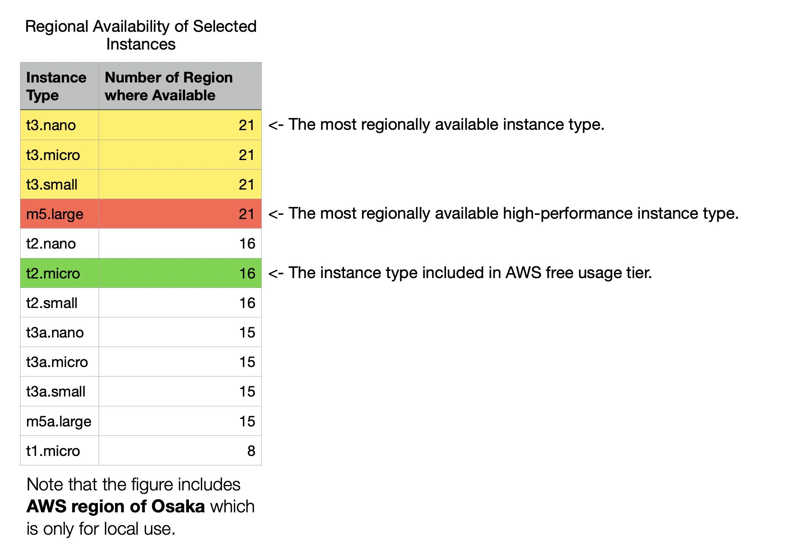

# Deploy to AWS (Beta)

> **Note:** The AWS deployment template is still in **BETA** phase. You may encounter failures during the deployment. In that case, please let us know the issue.

This template will create a fully-working IPSec/L2TP VPN server on AWS (Amazon Web Service). Please make sure to check the [pricing details](https://aws.amazon.com/ec2/pricing/on-demand/) of Virtual Machine on EC2 before starting the launch sequence.

You can also use `t2.micro` instance as your server for your deployment, which is free of charge within the first year since your AWS account is registered. For more information on AWS free usage tier, go to [this page](https://aws.amazon.com/free/).

## Available Customization Parameters:

- AWS EC2 Instance Type ([explained here](#instance-type-selection))
- OS for your VPN Server (Ubuntu16.04, Ubuntu18.04 or Debian9-stretch)
- Your VPN username
- Your VPN password
- IPSec PSK (pre-shared key)

> When choosing your username and password, do not enter special characters like `" ' \`.

Make sure to do this with an **AWS ROOT ACCOUNT** or an **IAM ACCOUNT** with **ADMINISTRATION PRVILEGE**. AWS Cloudformation requires the template file to be store on AWS S3, while a [copy](./MonAug17-production1.0) is available on Github. If you want to make any contributions to this template, make sure to contact me so that I can update the template on S3.

If you are confused about the instance type available, check out [this section](#instance-type-selection).

Click the icon below to initiate the launching sequence.

Make sure that the deployment is successful before going to the [Next Step : Configure VPN Clients](../docs/clients.md).

## Instance Type Selection

I have made only a few general-purpose, x64-based instance types available. That's because not all instance types are available in all AWS Regions. Even some of the instance types available in the template are not available in certain AWS regions. So be careful which instance type to choose. The figure below shows the number of regions where each of the selectable instance type is available. 

A spreadsheet that includes the raw instance data across all AWS regions is available [here](https://vpn-tutorial-template.s3.ca-central-1.amazonaws.com/Analysis+on+Regional+Availability+of+Selected+Instances+Types+on+AWS+EC2.xlsx). 

## Author

Copyright (C) 2020 [S. X. Liang](https://github.com/scottpedia)