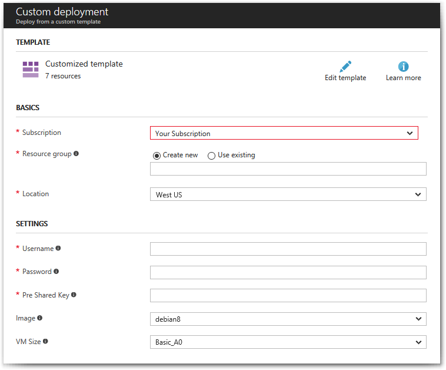

[English](README.md) | [中文](README-zh.md)

# Deploy to Microsoft Azure

This template will create a fully working VPN server on the Microsoft Azure Cloud ([pricing details](https://azure.microsoft.com/en-us/pricing/details/virtual-machines/)).

Customizable with the following options:

 - Username for VPN **and** SSH
 - Password for VPN **and** SSH
 - IPsec Pre-Shared Key for VPN
 - Operating System Image (Ubuntu 22.04, 20.04 or 18.04)
 - Virtual Machine Size (Default: Standard_B1s)

**Note:** DO NOT use these special characters within values: `\ " '`

Press this button to start:

When the deployment finishes, Azure displays a notification. Next steps: [Configure VPN Clients](../README.md#next-steps).

**Note:** When connecting to the server using SSH, use the username and password you specified in the deployment template. To add or export IKEv2 clients, run `sudo ikev2.sh`. If somehow you still cannot SSH into the VM after entering the correct login credentials, see [Troubleshoot SSH connections to an Azure Linux VM that fails, errors out, or is refused](https://docs.microsoft.com/en-us/troubleshoot/azure/virtual-machines/troubleshoot-ssh-connection) and/or [Can't SSH to Azure Linux VM because permissions are too open](https://docs.microsoft.com/en-us/troubleshoot/azure/virtual-machines/troubleshoot-ssh-permissions-too-open).

## Authors

Copyright (C) 2016 [Daniel Falkner](https://github.com/derdanu)   
Copyright (C) 2017-2023 [Lin Song](https://github.com/hwdsl2)

## Screenshot

Click to see screenshot.

