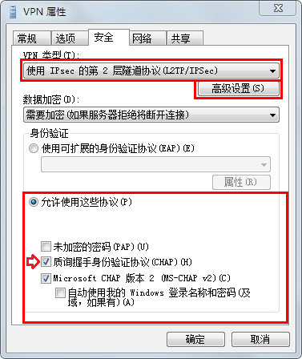

# 配置 IPsec/L2TP VPN 客户端

*其他语言版本: [English](clients.md), [简体中文](clients-zh.md).*

**注：** 你也可以使用 [IKEv2](ikev2-howto-zh.md)（推荐）或者 [IPsec/XAuth](clients-xauth-zh.md) 模式连接。

在成功 <a href="../README-zh.md" target="_blank">搭建自己的 VPN 服务器</a> 之后，按照下面的步骤来配置你的设备。IPsec/L2TP 在 Android, iOS, OS X 和 Windows 上均受支持，无需安装额外的软件。设置过程通常只需要几分钟。如果无法连接,请首先检查是否输入了正确的 VPN 登录凭证。

---
* 平台名称
  * [Windows](#windows)
  * [OS X (macOS)](#os-x)
  * [Android](#android)
  * [iOS (iPhone/iPad)](#ios)
  * [Chromebook](#chromebook)
  * [Linux](#linux)
* [故障排除](#故障排除)

## Windows

**注：** 你也可以使用 [IKEv2](ikev2-howto-zh.md) 模式连接（推荐）。

### Windows 10 and 8.x

1. 右键单击系统托盘中的无线/网络图标。
1. 选择 **打开网络和共享中心**。或者，如果你使用 Windows 10 版本 1709 或以上，选择 **打开"网络和 Internet"设置**，然后在打开的页面中单击 **网络和共享中心**。
1. 单击 **设置新的连接或网络**。
1. 选择 **连接到工作区**，然后单击 **下一步**。
1. 单击 **使用我的Internet连接 (VPN)**。
1. 在 **Internet地址** 字段中输入`你的 VPN 服务器 IP`。
1. 在 **目标名称** 字段中输入任意内容。单击 **创建**。
1. 返回 **网络和共享中心**。单击左侧的 **更改适配器设置**。
1. 右键单击新创建的 VPN 连接，并选择 **属性**。
1. 单击 **安全** 选项卡，从 **VPN 类型** 下拉菜单中选择 "使用 IPsec 的第 2 层隧道协议 (L2TP/IPSec)"。
1. 单击 **允许使用这些协议**。选中 "质询握手身份验证协议 (CHAP)" 和 "Microsoft CHAP 版本 2 (MS-CHAP v2)" 复选框。
1. 单击 **高级设置** 按钮。
1. 单击 **使用预共享密钥作身份验证** 并在 **密钥** 字段中输入`你的 VPN IPsec PSK`。
1. 单击 **确定** 关闭 **高级设置**。
1. 单击 **确定** 保存 VPN 连接的详细信息。

**注：** 在首次连接之前需要<a href="#windows-错误-809">修改一次注册表</a>，以解决 VPN 服务器 和/或 客户端与 NAT （比如家用路由器）的兼容问题。

要连接到 VPN：单击系统托盘中的无线/网络图标，选择新的 VPN 连接，然后单击 **连接**。如果出现提示，在登录窗口中输入 `你的 VPN 用户名` 和 `密码` ，并单击 **确定**。最后你可以到 <a href="https://www.ipchicken.com" target="_blank">这里</a> 检测你的 IP 地址，应该显示为`你的 VPN 服务器 IP`。

如果在连接过程中遇到错误，请参见 <a href="#故障排除">故障排除</a>。

另外，除了按照以上步骤操作，你也可以运行下面的 Windows PowerShell 命令来创建 VPN 连接。将 `你的 VPN 服务器 IP` 和 `你的 VPN IPsec PSK` 换成你自己的值，用单引号括起来：

```console
# 不保存命令行历史记录
Set-PSReadlineOption –HistorySaveStyle SaveNothing
# 创建 VPN 连接
Add-VpnConnection -Name 'My IPsec VPN' -ServerAddress '你的 VPN 服务器 IP' -L2tpPsk '你的 VPN IPsec PSK' -TunnelType L2tp -EncryptionLevel Required -AuthenticationMethod Chap,MSChapv2 -Force -RememberCredential -PassThru
# 忽略 data encryption 警告（数据在 IPsec 隧道中已被加密）
```

### Windows 7, Vista and XP

1. 单击开始菜单，选择控制面板。
1. 进入 **网络和Internet** 部分。
1. 单击 **网络和共享中心**。
1. 单击 **设置新的连接或网络**。
1. 选择 **连接到工作区**，然后单击 **下一步**。
1. 单击 **使用我的Internet连接 (VPN)**。
1. 在 **Internet地址** 字段中输入`你的 VPN 服务器 IP`。
1. 在 **目标名称** 字段中输入任意内容。
1. 选中 **现在不连接；仅进行设置以便稍后连接** 复选框。
1. 单击 **下一步**。
1. 在 **用户名** 字段中输入`你的 VPN 用户名`。
1. 在 **密码** 字段中输入`你的 VPN 密码`。
1. 选中 **记住此密码** 复选框。
1. 单击 **创建**，然后单击 **关闭** 按钮。
1. 返回 **网络和共享中心**。单击左侧的 **更改适配器设置**。
1. 右键单击新创建的 VPN 连接，并选择 **属性**。
1. 单击 **选项** 选项卡，取消选中 **包括Windows登录域** 复选框。
1. 单击 **安全** 选项卡，从 **VPN 类型** 下拉菜单中选择 "使用 IPsec 的第 2 层隧道协议 (L2TP/IPSec)"。
1. 单击 **允许使用这些协议**。选中 "质询握手身份验证协议 (CHAP)" 和 "Microsoft CHAP 版本 2 (MS-CHAP v2)" 复选框。
1. 单击 **高级设置** 按钮。
1. 单击 **使用预共享密钥作身份验证** 并在 **密钥** 字段中输入`你的 VPN IPsec PSK`。
1. 单击 **确定** 关闭 **高级设置**。
1. 单击 **确定** 保存 VPN 连接的详细信息。

**注：** 在首次连接之前需要<a href="#windows-错误-809">修改一次注册表</a>，以解决 VPN 服务器 和/或 客户端与 NAT （比如家用路由器）的兼容问题。

要连接到 VPN：单击系统托盘中的无线/网络图标，选择新的 VPN 连接，然后单击 **连接**。如果出现提示，在登录窗口中输入 `你的 VPN 用户名` 和 `密码` ，并单击 **确定**。最后你可以到 <a href="https://www.ipchicken.com" target="_blank">这里</a> 检测你的 IP 地址，应该显示为`你的 VPN 服务器 IP`。

如果在连接过程中遇到错误，请参见 <a href="#故障排除">故障排除</a>。

## OS X

**注：** 你也可以使用 [IKEv2](ikev2-howto-zh.md)（推荐）或者 [IPsec/XAuth](clients-xauth-zh.md) 模式连接。

1. 打开系统偏好设置并转到网络部分。
1. 在窗口左下角单击 **+** 按钮。
1. 从 **接口** 下拉菜单选择 **VPN**。
1. 从 **VPN类型** 下拉菜单选择 **IPSec 上的 L2TP**。
1. 在 **服务名称** 字段中输入任意内容。
1. 单击 **创建**。
1. 在 **服务器地址** 字段中输入`你的 VPN 服务器 IP`。
1. 在 **帐户名称** 字段中输入`你的 VPN 用户名`。
1. 单击 **认证设置** 按钮。
1. 在 **用户认证** 部分，选择 **密码** 单选按钮，然后输入`你的 VPN 密码`。
1. 在 **机器认证** 部分，选择 **共享的密钥** 单选按钮，然后输入`你的 VPN IPsec PSK`。
1. 保持 **群组名称** 字段空白。
1. 单击 **好**。
1. 选中 **在菜单栏中显示 VPN 状态** 复选框。
1. **（重要）** 单击 **高级** 按钮，并选中 **通过VPN连接发送所有通信** 复选框。
1. **（重要）** 单击 **TCP/IP** 选项卡，并在 **配置IPv6** 部分中选择 **仅本地链接**。
1. 单击 **好** 关闭高级设置，然后单击 **应用** 保存VPN连接信息。

要连接到 VPN：使用菜单栏中的图标，或者打开系统偏好设置的网络部分，选择 VPN 并单击 **连接**。最后你可以到 <a href="https://www.ipchicken.com" target="_blank">这里</a> 检测你的 IP 地址，应该显示为`你的 VPN 服务器 IP`。

如果在连接过程中遇到错误，请参见 <a href="#故障排除">故障排除</a>。

## Android

**注：** 你也可以使用 [IKEv2](ikev2-howto-zh.md)（推荐）或者 [IPsec/XAuth](clients-xauth-zh.md) 模式连接。

1. 启动 **设置** 应用程序。
1. 单击 **网络和互联网**。或者，如果你使用 Android 7 或更早版本，在 **无线和网络** 部分单击 **更多...**。
1. 单击 **VPN**。
1. 单击 **添加VPN配置文件** 或窗口右上角的 **+**。
1. 在 **名称** 字段中输入任意内容。
1. 在 **类型** 下拉菜单选择 **L2TP/IPSec PSK**。
1. 在 **服务器地址** 字段中输入`你的 VPN 服务器 IP`。
1. 保持 **L2TP 密钥** 字段空白。
1. 保持 **IPSec 标识符** 字段空白。
1. 在 **IPSec 预共享密钥** 字段中输入`你的 VPN IPsec PSK`。
1. 单击 **保存**。
1. 单击新的VPN连接。
1. 在 **用户名** 字段中输入`你的 VPN 用户名`。
1. 在 **密码** 字段中输入`你的 VPN 密码`。
1. 选中 **保存帐户信息** 复选框。
1. 单击 **连接**。

VPN 连接成功后，会在通知栏显示图标。最后你可以到 <a href="https://www.ipchicken.com" target="_blank">这里</a> 检测你的 IP 地址，应该显示为`你的 VPN 服务器 IP`。

如果在连接过程中遇到错误，请参见 <a href="#故障排除">故障排除</a>。

## iOS

**注：** 你也可以使用 [IKEv2](ikev2-howto-zh.md)（推荐）或者 [IPsec/XAuth](clients-xauth-zh.md) 模式连接。

1. 进入设置 -> 通用 -> VPN。
1. 单击 **添加VPN配置...**。
1. 单击 **类型** 。选择 **L2TP** 并返回。
1. 在 **描述** 字段中输入任意内容。
1. 在 **服务器** 字段中输入`你的 VPN 服务器 IP`。
1. 在 **帐户** 字段中输入`你的 VPN 用户名`。
1. 在 **密码** 字段中输入`你的 VPN 密码`。
1. 在 **密钥** 字段中输入`你的 VPN IPsec PSK`。
1. 启用 **发送所有流量** 选项。
1. 单击右上角的 **完成**。
1. 启用 **VPN** 连接。

VPN 连接成功后，会在通知栏显示图标。最后你可以到 <a href="https://www.ipchicken.com" target="_blank">这里</a> 检测你的 IP 地址，应该显示为`你的 VPN 服务器 IP`。

如果在连接过程中遇到错误，请参见 <a href="#故障排除">故障排除</a>。

## Chromebook

1. 如果你尚未登录 Chromebook，请先登录。
1. 单击状态区（其中显示你的帐户头像）。
1. 单击 **设置**。
1. 在 **互联网连接** 部分，单击 **添加连接**。
1. 单击 **添加 OpenVPN / L2TP**。
1. 在 **服务器主机名** 字段中输入`你的 VPN 服务器 IP`。
1. 在 **服务名称** 字段中输入任意内容。
1. 在 **供应商类型** 下拉菜单选择 **L2TP/IPsec + 预共享密钥**。
1. 在 **预共享密钥** 字段中输入`你的 VPN IPsec PSK`。
1. 在 **用户名** 字段中输入`你的 VPN 用户名`。
1. 在 **密码** 字段中输入`你的 VPN 密码`。
1. 单击 **连接**。

VPN 连接成功后，网络状态图标上会出现 VPN 指示。最后你可以到 <a href="https://www.ipchicken.com" target="_blank">这里</a> 检测你的 IP 地址，应该显示为`你的 VPN 服务器 IP`。

如果在连接过程中遇到错误，请参见 <a href="#故障排除">故障排除</a>。

## Linux

**注：** 你也可以使用 [IKEv2](ikev2-howto-zh.md) 模式连接（推荐）。

### Ubuntu Linux

Ubuntu 18.04 和更新版本用户可以使用 `apt` 安装 <a href="https://packages.ubuntu.com/search?keywords=network-manager-l2tp-gnome" target="_blank">network-manager-l2tp-gnome</a> 软件包，然后通过 GUI 配置 IPsec/L2TP VPN 客户端。Ubuntu 16.04 用户可能需要添加 `nm-l2tp` PPA，参见 <a href="https://medium.com/@hkdb/ubuntu-16-04-connecting-to-l2tp-over-ipsec-via-network-manager-204b5d475721" target="_blank">这里</a>。

1. 进入 Settings -> Network -> VPN。单击 **+** 按钮。
1. 选择 **Layer 2 Tunneling Protocol (L2TP)**。
1. 在 **Name** 字段中输入任意内容。
1. 在 **Gateway** 字段中输入`你的 VPN 服务器 IP`。
1. 在 **User name** 字段中输入`你的 VPN 用户名`。
1. 右键单击 **Password** 字段中的 **?**，选择 **Store the password only for this user**。
1. 在 **Password** 字段中输入`你的 VPN 密码`。
1. 保持 **NT Domain** 字段空白。
1. 单击 **IPsec Settings...** 按钮。
1. 选中 **Enable IPsec tunnel to L2TP host** 复选框。
1. 保持 **Gateway ID** 字段空白。
1. 在 **Pre-shared key** 字段中输入`你的 VPN IPsec PSK`。
1. 展开 **Advanced** 部分。
1. 在 **Phase1 Algorithms** 字段中输入 `aes128-sha1-modp2048`。
1. 在 **Phase2 Algorithms** 字段中输入 `aes128-sha1`。
1. 单击 **OK**，然后单击 **Add** 保存 VPN 连接信息。
1. 启用 **VPN** 连接。

VPN 连接成功后，你可以到 <a href="https://www.ipchicken.com" target="_blank">这里</a> 检测你的 IP 地址，应该显示为`你的 VPN 服务器 IP`。

如果在连接过程中遇到错误，请尝试 <a href="https://github.com/nm-l2tp/NetworkManager-l2tp/blob/master/README.md#issue-with-not-stopping-system-xl2tpd-service" target="_blank">这个解决方案</a>。

### Fedora 和 CentOS

Fedora 28（和更新版本）和 CentOS 8/7 用户可以使用 [IPsec/XAuth](clients-xauth-zh.md) 模式连接。

### 其它 Linux

首先看 <a href="https://github.com/nm-l2tp/NetworkManager-l2tp/wiki/Prebuilt-Packages" target="_blank">这里</a> 以确认 `network-manager-l2tp` 和 `network-manager-l2tp-gnome` 软件包是否在你的 Linux 版本上可用。如果可用，安装它们（选择使用 strongSwan）并参见上面的说明。另外，你也可以 [使用命令行配置 Linux VPN 客户端](#使用命令行配置-linux-vpn-客户端)。

## 故障排除

*其他语言版本: [English](clients.md#troubleshooting), [简体中文](clients-zh.md#故障排除).*

* [Windows 错误 809](#windows-错误-809)
* [Windows 错误 789 或 691](#windows-错误-789-或-691)
* [Windows 错误 628 或 766](#windows-错误-628-或-766)
* [Windows 10 正在连接](#windows-10-正在连接)
* [Windows 10 升级](#windows-10-升级)
* [Windows 8/10 DNS 泄漏](#windows-810-dns-泄漏)
* [Android MTU/MSS 问题](#android-mtumss-问题)
* [Android 6 和 7](#android-6-和-7)
* [macOS 通过 VPN 发送通信](#macos-通过-vpn-发送通信)
* [iOS 13/14 和 macOS 10.15/11](#ios-1314-和-macos-101511)
* [iOS/Android 睡眠模式](#iosandroid-睡眠模式)
* [Debian 10 内核](#debian-10-内核)
* [Chromebook 连接问题](#chromebook-连接问题)
* [其它错误](#其它错误)
* [检查日志及 VPN 状态](#检查日志及-vpn-状态)

### Windows 错误 809

> 错误 809：无法建立计算机与 VPN 服务器之间的网络连接，因为远程服务器未响应。这可能是因为未将计算机与远程服务器之间的某种网络设备(如防火墙、NAT、路由器等)配置为允许 VPN 连接。请与管理员或服务提供商联系以确定哪种设备可能产生此问题。

**注：** 仅当你使用 IPsec/L2TP 模式连接到 VPN 时，才需要进行下面的注册表更改。对于 [IKEv2](ikev2-howto-zh.md) 和 [IPsec/XAuth](clients-xauth-zh.md) 模式，无需进行此更改。

要解决此错误，在首次连接之前需要<a href="https://documentation.meraki.com/MX-Z/Client_VPN/Troubleshooting_Client_VPN#Windows_Error_809" target="_blank">修改一次注册表</a>，以解决 VPN 服务器 和/或 客户端与 NAT （比如家用路由器）的兼容问题。请下载并导入下面的 `.reg` 文件，或者打开 <a href="http://www.cnblogs.com/xxcanghai/p/4610054.html" target="_blank">提升权限命令提示符</a> 并运行以下命令。**完成后必须重启计算机。**

- 适用于 Windows Vista, 7, 8.x 和 10 ([下载 .reg 文件](https://dl.ls20.com/reg-files/v1/Fix_VPN_Error_809_Windows_Vista_7_8_10_Reboot_Required.reg))

  ```console
  REG ADD HKLM\SYSTEM\CurrentControlSet\Services\PolicyAgent /v AssumeUDPEncapsulationContextOnSendRule /t REG_DWORD /d 0x2 /f
  ```

- 仅适用于 Windows XP ([下载 .reg 文件](https://dl.ls20.com/reg-files/v1/Fix_VPN_Error_809_Windows_XP_ONLY_Reboot_Required.reg))

  ```console
  REG ADD HKLM\SYSTEM\CurrentControlSet\Services\IPSec /v AssumeUDPEncapsulationContextOnSendRule /t REG_DWORD /d 0x2 /f
  ```

另外，某些个别的 Windows 系统配置禁用了 IPsec 加密，此时也会导致连接失败。要重新启用它，可以运行以下命令并重启。

- 适用于 Windows XP, Vista, 7, 8.x 和 10 ([下载 .reg 文件](https://dl.ls20.com/reg-files/v1/Fix_VPN_Error_809_Allow_IPsec_Reboot_Required.reg))

  ```console
  REG ADD HKLM\SYSTEM\CurrentControlSet\Services\RasMan\Parameters /v ProhibitIpSec /t REG_DWORD /d 0x0 /f
  ```

### Windows 错误 789 或 691

> 错误 789：L2TP 连接尝试失败，因为安全层在初始化与远程计算机的协商时遇到一个处理错误。

> 错误 691：由于指定的用户名和/或密码无效而拒绝连接。下列条件可能会导致此情况：用户名和/或密码键入错误...

对于错误 789，点击 [这里](https://documentation.meraki.com/MX/Client_VPN/Troubleshooting_Client_VPN#Windows_Error_789) 查看故障排除信息。对于错误 691，你可以尝试删除并重新创建 VPN 连接，按照本文档中的步骤操作。请确保输入了正确的 VPN 登录凭证。

### Windows 错误 628 或 766

> 错误 628：在连接完成前，连接被远程计算机终止。

> 错误 766：找不到证书。使用通过 IPSec 的 L2TP 协议的连接要求安装一个机器证书。它也叫做计算机证书。

要解决这些错误，请按以下步骤操作：

1. 右键单击系统托盘中的无线/网络图标。
1. 选择 **打开网络和共享中心**。或者，如果你使用 Windows 10 版本 1709 或以上，选择 **打开"网络和 Internet"设置**，然后在打开的页面中单击 **网络和共享中心**。
1. 单击左侧的 **更改适配器设置**。右键单击新的 VPN 连接，并选择 **属性**。
1. 单击 **安全** 选项卡，从 **VPN 类型** 下拉菜单中选择 "使用 IPsec 的第 2 层隧道协议 (L2TP/IPSec)"。
1. 单击 **允许使用这些协议**。选中 "质询握手身份验证协议 (CHAP)" 和 "Microsoft CHAP 版本 2 (MS-CHAP v2)" 复选框。
1. 单击 **高级设置** 按钮。
1. 单击 **使用预共享密钥作身份验证** 并在 **密钥** 字段中输入`你的 VPN IPsec PSK`。
1. 单击 **确定** 关闭 **高级设置**。
1. 单击 **确定** 保存 VPN 连接的详细信息。



### Windows 10 正在连接

如果你使用 Windows 10 并且 VPN 卡在 "正在连接" 状态超过几分钟，尝试以下步骤：

1. 右键单击系统托盘中的无线/网络图标。
1. 选择 **打开"网络和 Internet"设置**，然后在打开的页面中单击左侧的 **VPN**。
1. 选择新的 VPN 连接，然后单击 **连接**。如果出现提示，在登录窗口中输入 `你的 VPN 用户名` 和 `密码` ，并单击 **确定**。

### Windows 10 升级

在升级 Windows 10 版本之后 （比如从 1709 到 1803），你可能需要重新按照上面的 [Windows 错误 809](#windows-错误-809) 中的步骤修改注册表并重启。

### Windows 8/10 DNS 泄漏

Windows 8.x 和 10 默认使用 "smart multi-homed name resolution" （智能多宿主名称解析）。如果你的因特网适配器的 DNS 服务器在本地网段上，在使用 Windows 自带的 IPsec VPN 客户端时可能会导致 "DNS 泄漏"。要解决这个问题，你可以 <a href="https://www.neowin.net/news/guide-prevent-dns-leakage-while-using-a-vpn-on-windows-10-and-windows-8/" target="_blank">禁用智能多宿主名称解析</a>，或者配置你的因特网适配器以使用在你的本地网段之外的 DNS 服务器（比如 8.8.8.8 和 8.8.4.4）。在完成后<a href="https://support.opendns.com/hc/en-us/articles/227988627-How-to-clear-the-DNS-Cache-" target="_blank">清除 DNS 缓存</a>并且重启计算机。

另外，如果你的计算机启用了 IPv6，所有的 IPv6 流量（包括 DNS 请求）都将绕过 VPN。要在 Windows 上禁用 IPv6，请看<a href="https://support.microsoft.com/zh-cn/help/929852/guidance-for-configuring-ipv6-in-windows-for-advanced-users" target="_blank">这里</a>。如果你需要支持 IPv6 的 VPN，你可以另外尝试 <a href="https://github.com/Nyr/openvpn-install" target="_blank">OpenVPN</a>。

### Android MTU/MSS 问题

某些 Android 设备有 MTU/MSS 问题，表现为使用 IPsec/XAuth ("Cisco IPsec") 模式可以连接到 VPN 但是无法打开网站。如果你遇到该问题，尝试在 VPN 服务器上运行以下命令。如果成功解决，你可以将这些命令添加到 `/etc/rc.local` 以使它们重启后继续有效。

```
iptables -t mangle -A FORWARD -m policy --pol ipsec --dir in \
  -p tcp -m tcp --tcp-flags SYN,RST SYN -m tcpmss --mss 1361:1536 \
  -j TCPMSS --set-mss 1360
iptables -t mangle -A FORWARD -m policy --pol ipsec --dir out \
  -p tcp -m tcp --tcp-flags SYN,RST SYN -m tcpmss --mss 1361:1536 \
  -j TCPMSS --set-mss 1360

echo 1 > /proc/sys/net/ipv4/ip_no_pmtu_disc
```

**Docker 用户：** 要修复这个问题，不需要运行以上命令。你可以在<a href="https://github.com/hwdsl2/docker-ipsec-vpn-server/blob/master/README-zh.md#如何使用本镜像" target="_blank">你的 env 文件</a>中添加 `VPN_ANDROID_MTU_FIX=yes`，然后重新创建 Docker 容器。

参考链接：<a href="https://wiki.strongswan.org/projects/strongswan/wiki/ForwardingAndSplitTunneling#MTUMSS-issues" target="_blank">[1]</a> <a href="https://www.zeitgeist.se/2013/11/26/mtu-woes-in-ipsec-tunnels-how-to-fix/" target="_blank">[2]</a>。

### Android 6 和 7

如果你的 Android 6.x 或者 7.x 设备无法连接，请尝试以下步骤：

1. 单击 VPN 连接旁边的设置按钮，选择 "Show advanced options" 并且滚动到底部。如果选项 "Backward compatible mode" 存在（看下图），请启用它并重试连接。如果不存在，请尝试下一步。
1. 编辑 VPN 服务器上的 `/etc/ipsec.conf`。找到 `sha2-truncbug` 一行并切换它的值。也就是说，将 `sha2-truncbug=no` 替换为 `sha2-truncbug=yes`，或者将 `sha2-truncbug=yes` 替换为 `sha2-truncbug=no`。保存修改并运行 `service ipsec restart`。然后重新连接 VPN。

**Docker 用户：** 如需在 `/etc/ipsec.conf` 中设置 `sha2-truncbug=yes`（默认为 `no`），你可以在<a href="https://github.com/hwdsl2/docker-ipsec-vpn-server/blob/master/README-zh.md#如何使用本镜像" target="_blank">你的 env 文件</a>中添加 `VPN_SHA2_TRUNCBUG=yes`，然后重新创建 Docker 容器。


### macOS 通过 VPN 发送通信

OS X (macOS) 用户： 如果可以成功地使用 IPsec/L2TP 模式连接，但是你的公有 IP 没有显示为 `你的 VPN 服务器 IP`，请阅读上面的 [OS X](#os-x) 部分并完成以下步骤。保存 VPN 配置然后重新连接。

1. 单击 **高级** 按钮，并选中 **通过VPN连接发送所有通信** 复选框。
1. 单击 **TCP/IP** 选项卡，并在 **配置IPv6** 部分中选择 **仅本地链接**。

如果在尝试上面步骤之后，你的计算机仍然不能通过 VPN 连接发送通信，检查一下服务顺序。进入系统偏好设置中的网络部分，单击左侧连接列表下方的齿轮按钮，选择 "设定服务顺序"。然后将 VPN 连接拖动到顶端。

### iOS 13/14 和 macOS 10.15/11

如果你的 iOS 13/14, macOS 10.15 (Catalina) 或者 macOS 11 (Big Sur) 设备无法连接，请尝试以下步骤：编辑 VPN 服务器上的 `/etc/ipsec.conf`。找到 `sha2-truncbug=yes` 并将它替换为 `sha2-truncbug=no`。保存修改并运行 `service ipsec restart`。然后重新连接 VPN。

另外，macOS Big Sur 11.0 用户应该更新到版本 11.1 或以上，以修复 VPN 连接的某些问题。要检查 macOS 版本并安装更新，请看<a href="https://www.businessinsider.com/how-to-check-mac-os-version" target="_blank">这里</a>。

### iOS/Android 睡眠模式

为了节约电池，iOS 设备 (iPhone/iPad) 在屏幕变黑（睡眠模式）之后不久就会自动断开 Wi-Fi 连接。这会导致 IPsec VPN 断开。该行为是被 <a href="https://discussions.apple.com/thread/2333948" target="_blank">故意设计的</a> 并且不能被配置。

如果需要 VPN 在设备唤醒后自动重连，你可以使用 [IKEv2](ikev2-howto-zh.md) 模式连接（推荐）并启用 "VPN On Demand" 功能。或者你也可以另外尝试使用 <a href="https://github.com/Nyr/openvpn-install" target="_blank">OpenVPN</a>，它支持 <a href="https://docs.openvpn.net/connecting/connecting-to-access-server-with-apple-ios/faq-regarding-openvpn-connect-ios/" target="_blank">一些选项</a> 比如 "Reconnect on Wakeup" 和 "Seamless Tunnel"。

Android 设备在进入睡眠模式不久后也会断开 Wi-Fi 连接，如果你没有启用选项 "睡眠期间保持 WLAN 开启" 的话。该选项在 Android 8 (Oreo) 和更新版本中不再可用。另外，你也可以尝试打开 "始终开启 VPN" 选项以保持连接。详情请看 <a href="https://support.google.com/android/answer/9089766?hl=zh-Hans" target="_blank">这里</a>。

### Debian 10 内核

Debian 10 用户：运行 `uname -r` 以检查你的服务器的 Linux 内核版本。如果它包含 `cloud` 字样，并且 `/dev/ppp` 不存在，则该内核缺少 `ppp` 支持从而不能使用 IPsec/L2TP 模式。VPN 安装脚本会尝试检测此情形，并显示错误。

要解决此问题，你可以换用标准的 Linux 内核，通过安装比如 `linux-image-amd64` 软件包来实现。然后更新 GRUB 的内核默认值并重启服务器。最后重新运行 VPN 安装脚本。

### Chromebook 连接问题

Chromebook 用户： 如果你无法连接，请尝试以下步骤：编辑 VPN 服务器上的 `/etc/ipsec.conf`。找到这一行 `phase2alg=...` 并在结尾加上 `,aes_gcm-null` 。保存修改并运行 `service ipsec restart`。

### 其它错误

如果你遇到其它错误，请参见以下链接：

* http://www.tp-link.com/en/faq-1029.html
* https://documentation.meraki.com/MX-Z/Client_VPN/Troubleshooting_Client_VPN#Common_Connection_Issues   
* https://stackoverflow.com/questions/25245854/windows-8-1-gets-error-720-on-connect-vpn

### 检查日志及 VPN 状态

以下命令需要使用 `root` 账户（或者 `sudo`）运行。

首先，重启 VPN 服务器上的相关服务：

```bash
service ipsec restart
service xl2tpd restart
```

**Docker 用户：** 运行 `docker restart ipsec-vpn-server`。

然后重启你的 VPN 客户端设备，并重试连接。如果仍然无法连接，可以尝试删除并重新创建 VPN 连接，按照本文档中的步骤操作。请确保输入了正确的 VPN 登录凭证。

检查 Libreswan (IPsec) 和 xl2tpd 日志是否有错误：

```bash
# Ubuntu & Debian
grep pluto /var/log/auth.log
grep xl2tpd /var/log/syslog

# CentOS/RHEL & Amazon Linux 2
grep pluto /var/log/secure
grep xl2tpd /var/log/messages
```

查看 IPsec VPN 服务器状态：

```bash
ipsec status
ipsec verify
```

显示当前已建立的 VPN 连接：

```bash
ipsec whack --trafficstatus
```

## 使用命令行配置 Linux VPN 客户端

在成功 <a href="../README-zh.md" target="_blank">搭建自己的 VPN 服务器</a> 之后，按照下面的步骤来使用命令行配置 Linux VPN 客户端。另外，你也可以使用 [IKEv2](ikev2-howto-zh.md) 模式连接（推荐），或者 [使用图形界面配置](#linux) 。以下步骤是基于 [Peter Sanford 的工作](https://gist.github.com/psanford/42c550a1a6ad3cb70b13e4aaa94ddb1c)。这些命令必须在你的 VPN 客户端上使用 `root` 账户运行。

要配置 VPN 客户端，首先安装以下软件包：

```bash
# Ubuntu and Debian
apt-get update
apt-get install strongswan xl2tpd net-tools

# Fedora
yum install strongswan xl2tpd net-tools

# CentOS
yum install epel-release
yum --enablerepo=epel install strongswan xl2tpd net-tools
```

创建 VPN 变量（替换为你自己的值）：

```bash
VPN_SERVER_IP='你的VPN服务器IP'
VPN_IPSEC_PSK='你的IPsec预共享密钥'
VPN_USER='你的VPN用户名'
VPN_PASSWORD='你的VPN密码'
```

配置 strongSwan：

```bash
cat > /etc/ipsec.conf <<EOF
# ipsec.conf - strongSwan IPsec configuration file

conn myvpn
  auto=add
  keyexchange=ikev1
  authby=secret
  type=transport
  left=%defaultroute
  leftprotoport=17/1701
  rightprotoport=17/1701
  right=$VPN_SERVER_IP
  ike=aes128-sha1-modp2048
  esp=aes128-sha1
EOF

cat > /etc/ipsec.secrets <<EOF
: PSK "$VPN_IPSEC_PSK"
EOF

chmod 600 /etc/ipsec.secrets

# For CentOS and Fedora ONLY
mv /etc/strongswan/ipsec.conf /etc/strongswan/ipsec.conf.old 2>/dev/null
mv /etc/strongswan/ipsec.secrets /etc/strongswan/ipsec.secrets.old 2>/dev/null
ln -s /etc/ipsec.conf /etc/strongswan/ipsec.conf
ln -s /etc/ipsec.secrets /etc/strongswan/ipsec.secrets
```

配置 xl2tpd：

```bash
cat > /etc/xl2tpd/xl2tpd.conf <<EOF
[lac myvpn]
lns = $VPN_SERVER_IP
ppp debug = yes
pppoptfile = /etc/ppp/options.l2tpd.client
length bit = yes
EOF

cat > /etc/ppp/options.l2tpd.client <<EOF
ipcp-accept-local
ipcp-accept-remote
refuse-eap
require-chap
noccp
noauth
mtu 1280
mru 1280
noipdefault
defaultroute
usepeerdns
connect-delay 5000
name "$VPN_USER"
password "$VPN_PASSWORD"
EOF

chmod 600 /etc/ppp/options.l2tpd.client
```

至此 VPN 客户端配置已完成。按照下面的步骤进行连接。

**注：** 当你每次尝试连接到 VPN 时，必须重复下面的所有步骤。

创建 xl2tpd 控制文件：

```bash
mkdir -p /var/run/xl2tpd
touch /var/run/xl2tpd/l2tp-control
```

重启服务：

```bash
service strongswan restart
service xl2tpd restart
```

开始 IPsec 连接：

```bash
# Ubuntu and Debian
ipsec up myvpn

# CentOS and Fedora
strongswan up myvpn
```

开始 L2TP 连接：

```bash
echo "c myvpn" > /var/run/xl2tpd/l2tp-control
```

运行 `ifconfig` 并且检查输出。现在你应该看到一个新的网络接口 `ppp0`。

检查你现有的默认路由：

```bash
ip route
```

在输出中查找以下行： `default via X.X.X.X ...`。记下这个网关 IP，并且在下面的两个命令中使用。

从新的默认路由中排除你的 VPN 服务器 IP （替换为你自己的值）：

```bash
route add 你的VPN服务器IP gw X.X.X.X
```

如果你的 VPN 客户端是一个远程服务器，则必须从新的默认路由中排除你的本地电脑的公有 IP，以避免 SSH 会话被断开 （替换为<a href="https://www.ipchicken.com" target="_blank">实际值</a>）：

```bash
route add 你的本地电脑的公有IP gw X.X.X.X
```

添加一个新的默认路由，并且开始通过 VPN 服务器发送数据：

```bash
route add default dev ppp0
```

至此 VPN 连接已成功完成。检查 VPN 是否正常工作：

```bash
wget -qO- http://ipv4.icanhazip.com; echo
```

以上命令应该返回 `你的 VPN 服务器 IP`。


要停止通过 VPN 服务器发送数据：

```bash
route del default dev ppp0
```

要断开连接：

```bash
# Ubuntu and Debian
echo "d myvpn" > /var/run/xl2tpd/l2tp-control
ipsec down myvpn

# CentOS and Fedora
echo "d myvpn" > /var/run/xl2tpd/l2tp-control
strongswan down myvpn
```

## 致谢

本文档是在 <a href="https://github.com/StreisandEffect/streisand" target="_blank">Streisand</a> 项目文档基础上翻译和修改。该项目由 Joshua Lund 和其他开发者维护。

## 授权协议

注： 这个协议仅适用于本文档。

版权所有 (C) 2016-2021 <a href="https://www.linkedin.com/in/linsongui" target="_blank">Lin Song</a>   
基于 <a href="https://github.com/StreisandEffect/streisand/blob/6aa6b6b2735dd829ca8c417d72eb2768a89b6639/playbooks/roles/l2tp-ipsec/templates/instructions.md.j2" target="_blank">Joshua Lund 的工作</a> (版权所有 2014-2016)

本程序为自由软件，在自由软件联盟发布的<a href="https://www.gnu.org/licenses/gpl.html" target="_blank"> GNU 通用公共许可协议</a>的约束下，你可以对其进行再发布及修改。协议版本为第三版或（随你）更新的版本。

我们希望发布的这款程序有用，但不保证，甚至不保证它有经济价值和适合特定用途。详情参见GNU通用公共许可协议。
