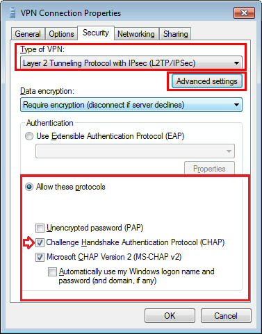

# Configure IPsec/L2TP VPN Clients

*Read this in other languages: [English](clients.md), [简体中文](clients-zh.md).*

*Note: You may also connect using [IPsec/XAuth mode](clients-xauth.md), or set up [IKEv2](ikev2-howto.md).*

After <a href="https://github.com/hwdsl2/setup-ipsec-vpn" target="_blank">setting up your own VPN server</a>, follow these steps to configure your devices. IPsec/L2TP is natively supported by Android, iOS, OS X, and Windows. There is no additional software to install. Setup should only take a few minutes. In case you are unable to connect, first check to make sure the VPN credentials were entered correctly.

An alternative <a href="https://usefulpcguide.com/17318/create-your-own-vpn/" target="_blank">setup guide</a> with images is available, written by Tony Tran.

---
* Platforms
  * [Windows](#windows)
  * [OS X (macOS)](#os-x)
  * [Android](#android)
  * [iOS (iPhone/iPad)](#ios)
  * [Chromebook](#chromebook)
  * [Windows Phone](#windows-phone)
  * [Linux](#linux)
* [Troubleshooting](#troubleshooting)
  * [Windows Error 809](#windows-error-809)
  * [Windows Error 628](#windows-error-628)
  * [Android 6 and 7](#android-6-and-7)
  * [Other Errors](#other-errors)

## Windows

### Windows 10 and 8.x

1. Right-click on the wireless/network icon in your system tray.
1. Select **Open Network and Sharing Center**.
1. Click **Set up a new connection or network**.
1. Select **Connect to a workplace** and click **Next**.
1. Click **Use my Internet connection (VPN)**.
1. Enter `Your VPN Server IP` in the **Internet address** field.
1. Enter anything you like in the **Destination name** field, and then click **Create**.
1. Return to **Network and Sharing Center**. On the left, click **Change adapter settings**.
1. Right-click on the new VPN entry and choose **Properties**.
1. Click the **Security** tab. Select "Layer 2 Tunneling Protocol with IPsec (L2TP/IPSec)" for the **Type of VPN**.
1. Click **Allow these protocols**. Be sure to select the "Challenge Handshake Authentication Protocol (CHAP)" checkbox.
1. Click the **Advanced settings** button.
1. Select **Use preshared key for authentication** and enter `Your VPN IPsec PSK` for the **Key**.
1. Click **OK** to close the **Advanced settings**.
1. Click **OK** to save the VPN connection details.

### Windows 7, Vista and XP

1. Click on the Start Menu and go to the Control Panel.
1. Go to the **Network and Internet** section.
1. Click **Network and Sharing Center**.
1. Click **Set up a new connection or network**.
1. Select **Connect to a workplace** and click **Next**.
1. Click **Use my Internet connection (VPN)**.
1. Enter `Your VPN Server IP` in the **Internet address** field.
1. Enter anything you like in the **Destination name** field.
1. Check the **Don't connect now; just set it up so I can connect later** checkbox.
1. Click **Next**.
1. Enter `Your VPN Username` in the **User name** field.
1. Enter `Your VPN Password` in the **Password** field.
1. Check the **Remember this password** checkbox.
1. Click **Create**, and then **Close**.
1. Return to **Network and Sharing Center**. On the left, click **Change adapter settings**.
1. Right-click on the new VPN entry and choose **Properties**.
1. Click the **Options** tab and uncheck **Include Windows logon domain**.
1. Click the **Security** tab. Select "Layer 2 Tunneling Protocol with IPsec (L2TP/IPSec)" for the **Type of VPN**.
1. Click **Allow these protocols**. Be sure to select the "Challenge Handshake Authentication Protocol (CHAP)" checkbox.
1. Click the **Advanced settings** button.
1. Select **Use preshared key for authentication** and enter `Your VPN IPsec PSK` for the **Key**.
1. Click **OK** to close the **Advanced settings**.
1. Click **OK** to save the VPN connection details.

To connect to the VPN: Click on the wireless/network icon in your system tray, select the new VPN entry, and click **Connect**. If prompted, enter `Your VPN Username` and `Password`, then click **OK**. You can verify that your traffic is being routed properly by <a href="https://encrypted.google.com/search?q=my+ip" target="_blank">looking up your IP address on Google</a>. It should say "Your public IP address is `Your VPN Server IP`".

If you get an error when trying to connect, see <a href="#troubleshooting">Troubleshooting</a>.

## OS X

1. Open System Preferences and go to the Network section.
1. Click the **+** button in the lower-left corner of the window.
1. Select **VPN** from the **Interface** drop-down menu.
1. Select **L2TP over IPSec** from the **VPN Type** drop-down menu.
1. Enter anything you like for the **Service Name**.
1. Click **Create**.
1. Enter `Your VPN Server IP` for the **Server Address**.
1. Enter `Your VPN Username` for the **Account Name**.
1. Click the **Authentication Settings** button.
1. In the **User Authentication** section, select the **Password** radio button and enter `Your VPN Password`.
1. In the **Machine Authentication** section, select the **Shared Secret** radio button and enter `Your VPN IPsec PSK`.
1. Click **OK**.
1. Check the **Show VPN status in menu bar** checkbox.
1. Click the **Advanced** button and make sure the **Send all traffic over VPN connection** checkbox is checked.
1. Click the **TCP/IP** tab, and make sure **Link-local only** is selected in the **Configure IPv6** section.
1. Click **OK** to close the Advanced settings, and then click **Apply** to save the VPN connection information.

To connect to the VPN: Use the menu bar icon, or go to the Network section of System Preferences, select the VPN and choose **Connect**. You can verify that your traffic is being routed properly by <a href="https://encrypted.google.com/search?q=my+ip" target="_blank">looking up your IP address on Google</a>. It should say "Your public IP address is `Your VPN Server IP`".

## Android

1. Launch the **Settings** application.
1. Tap **More...** in the **Wireless & Networks** section.
1. Tap **VPN**.
1. Tap **Add VPN Profile** or the **+** icon at top-right of screen.
1. Enter anything you like in the **Name** field.
1. Select **L2TP/IPSec PSK** in the **Type** drop-down menu.
1. Enter `Your VPN Server IP` in the **Server address** field.
1. Enter `Your VPN IPsec PSK` in the **IPSec pre-shared key** field.
1. Tap **Save**.
1. Tap the new VPN connection.
1. Enter `Your VPN Username` in the **Username** field.
1. Enter `Your VPN Password` in the **Password** field.
1. Check the **Save account information** checkbox.
1. Tap **Connect**.

Once connected, you will see a VPN icon in the notification bar. You can verify that your traffic is being routed properly by <a href="https://encrypted.google.com/search?q=my+ip" target="_blank">looking up your IP address on Google</a>. It should say "Your public IP address is `Your VPN Server IP`".

If you get an error when trying to connect, see <a href="#troubleshooting">Troubleshooting</a>.

## iOS

1. Go to Settings -> General -> VPN.
1. Tap **Add VPN Configuration...**.
1. Tap **Type**. Select **L2TP** and go back.
1. Tap **Description** and enter anything you like.
1. Tap **Server** and enter `Your VPN Server IP`.
1. Tap **Account** and enter `Your VPN Username`.
1. Tap **Password** and enter `Your VPN Password`.
1. Tap **Secret** and enter `Your VPN IPsec PSK`.
1. Make sure the **Send All Traffic** switch is ON.
1. Tap **Done**.
1. Slide the **VPN** switch ON.

Once connected, you will see a VPN icon in the status bar. You can verify that your traffic is being routed properly by <a href="https://encrypted.google.com/search?q=my+ip" target="_blank">looking up your IP address on Google</a>. It should say "Your public IP address is `Your VPN Server IP`".

## Chromebook

1. If you haven't already, sign in to your Chromebook.
1. Click the status area, where your account picture appears.
1. Click **Settings**.
1. In the **Internet connection** section, click **Add connection**.
1. Click **Add OpenVPN / L2TP**.
1. Enter `Your VPN Server IP` for the **Server hostname**.
1. Enter anything you like for the **Service name**.
1. Make sure **Provider type** is **L2TP/IPSec + pre-shared key**.
1. Enter `Your VPN IPsec PSK` for the **Pre-shared key**.
1. Enter `Your VPN Username` for the **Username**.
1. Enter `Your VPN Password` for the **Password**.
1. Click **Connect**.

Once connected, you will see a VPN icon overlay on the network status icon. You can verify that your traffic is being routed properly by <a href="https://encrypted.google.com/search?q=my+ip" target="_blank">looking up your IP address on Google</a>. It should say "Your public IP address is `Your VPN Server IP`".

## Windows Phone

Users with Windows Phone 8.1 and above, try <a href="http://forums.windowscentral.com/windows-phone-8-1-preview-developers/301521-tutorials-windows-phone-8-1-support-l2tp-ipsec-vpn-now.html" target="_blank">this tutorial</a>. You can verify that your traffic is being routed properly by <a href="https://encrypted.google.com/search?q=my+ip" target="_blank">looking up your IP address on Google</a>. It should say "Your public IP address is `Your VPN Server IP`".

## Linux

Note: Instructions below are adapted from [the work of Peter Sanford](https://gist.github.com/psanford/42c550a1a6ad3cb70b13e4aaa94ddb1c). Commands must be run as `root` on your VPN client.

To set up the VPN client, first install the following packages:

```
# Ubuntu & Debian
apt-get update
apt-get -y install strongswan xl2tpd

# CentOS & RHEL
yum -y install epel-release
yum -y install strongswan xl2tpd

# Fedora
yum -y install strongswan xl2tpd
```

Create VPN variables (replace with actual values):

```
VPN_SERVER_IP='your_vpn_server_ip'
VPN_IPSEC_PSK='your_ipsec_pre_shared_key'
VPN_USERNAME='your_vpn_username'
VPN_PASSWORD='your_vpn_password'
```

Configure strongSwan:
```
cat > /etc/ipsec.conf <<EOF
# ipsec.conf - strongSwan IPsec configuration file

# basic configuration

config setup
  # strictcrlpolicy=yes
  # uniqueids = no

# Add connections here.

# Sample VPN connections

conn %default
  ikelifetime=60m
  keylife=20m
  rekeymargin=3m
  keyingtries=1
  keyexchange=ikev1
  authby=secret
  ike=aes128-sha1-modp1024,3des-sha1-modp1024!
  esp=aes128-sha1-modp1024,3des-sha1-modp1024!

conn myvpn
  keyexchange=ikev1
  left=%defaultroute
  auto=add
  authby=secret
  type=transport
  leftprotoport=17/1701
  rightprotoport=17/1701
  right=$VPN_SERVER_IP
EOF

cat > /etc/ipsec.secrets <<EOF
: PSK "$VPN_IPSEC_PSK"
EOF

chmod 600 /etc/ipsec.secrets

# For CentOS/RHEL & Fedora ONLY
mv /etc/strongswan/ipsec.conf /etc/strongswan/ipsec.conf.old 2>/dev/null
mv /etc/strongswan/ipsec.secrets /etc/strongswan/ipsec.secrets.old 2>/dev/null
ln -s /etc/ipsec.conf /etc/strongswan/ipsec.conf
ln -s /etc/ipsec.secrets /etc/strongswan/ipsec.secrets
```

Configure xl2tpd:
```
cat > /etc/xl2tpd/xl2tpd.conf <<EOF
[lac myvpn]
lns = $VPN_SERVER_IP
ppp debug = yes
pppoptfile = /etc/ppp/options.l2tpd.client
length bit = yes
EOF

cat > /etc/ppp/options.l2tpd.client <<EOF
ipcp-accept-local
ipcp-accept-remote
refuse-eap
require-chap
noccp
noauth
mtu 1280
mru 1280
noipdefault
defaultroute
usepeerdns
debug
lock
connect-delay 5000
name $VPN_USERNAME
password $VPN_PASSWORD
EOF

chmod 600 /etc/ppp/options.l2tpd.client
```

The VPN client setup is now complete. Follow the steps below to connect.

Create xl2tpd control file:
```
mkdir -p /var/run/xl2tpd
touch /var/run/xl2tpd/l2tp-control
```

Restart services:
```
service strongswan restart
service xl2tpd restart
```

Start the IPsec connection:
```
# Ubuntu & Debian
ipsec up myvpn

# CentOS/RHEL & Fedora
strongswan up myvpn
```

Start the L2TP connection:
```
echo "c myvpn" > /var/run/xl2tpd/l2tp-control
```

Run `ifconfig` and check the output. You should now see a new interface `ppp0`.

Check your existing default route:
```
ip route
```

Find this line in the output: `default via X.X.X.X ...`. Write down this gateway IP for use in the two commands below.

Exclude your VPN server's IP from the new default route (replace with actual value):
```
route add YOUR_VPN_SERVER_IP gw X.X.X.X
```

If your VPN client is a remote server, you must also exclude your Local PC's public IP from the new default route, to prevent your SSH session from being disconnected (replace with your actual public IP <a href="https://encrypted.google.com/search?q=my+ip" target="_blank">from here</a>):
```
route add YOUR_LOCAL_PC_PUBLIC_IP gw X.X.X.X
```

Add a new default route to start routing traffic via the VPN server：
```
route add default dev ppp0
```

The VPN connection is now complete. Verify that your traffic is being routed properly:
```
wget -qO- http://ipv4.icanhazip.com; echo
```

The above command should return `Your VPN Server IP`.

To stop routing traffic via the VPN server:
```
route del default dev ppp0
```

To disconnect:
```
# Ubuntu & Debian
echo "d myvpn" > /var/run/xl2tpd/l2tp-control
ipsec down myvpn

# CentOS/RHEL & Fedora
echo "d myvpn" > /var/run/xl2tpd/l2tp-control
strongswan down myvpn
```

## Troubleshooting

*Read this in other languages: [English](clients.md#troubleshooting), [简体中文](clients-zh.md#故障排除).*

### Windows Error 809

> The network connection between your computer and the VPN server could not be established because the remote server is not responding.

To fix this error, a <a href="https://documentation.meraki.com/MX-Z/Client_VPN/Troubleshooting_Client_VPN#Windows_Error_809" target="_blank">one-time registry change</a> is required because the VPN server and/or client is behind NAT (e.g. home router). Refer to the linked web page, or run the following from an <a href="http://www.winhelponline.com/blog/open-elevated-command-prompt-windows/" target="_blank">elevated command prompt</a>. When finished, reboot your PC.

- For Windows Vista, 7, 8.x and 10
  ```console
  REG ADD HKLM\SYSTEM\CurrentControlSet\Services\PolicyAgent /v AssumeUDPEncapsulationContextOnSendRule /t REG_DWORD /d 0x2 /f
  ```

- For Windows XP ONLY
  ```console
  REG ADD HKLM\SYSTEM\CurrentControlSet\Services\IPSec /v AssumeUDPEncapsulationContextOnSendRule /t REG_DWORD /d 0x2 /f
  ```

### Windows Error 628

> The connection was terminated by the remote computer before it could be completed.

To fix this error, please follow these steps:

1. Right-click on the wireless/network icon in system tray, select **Open Network and Sharing Center**.
1. On the left, click **Change adapter settings**. Right-click on the new VPN and choose **Properties**.
1. Click the **Security** tab. Select "Layer 2 Tunneling Protocol with IPsec (L2TP/IPSec)" for **Type of VPN**.
1. Click **Allow these protocols**. Be sure to select the "Challenge Handshake Authentication Protocol (CHAP)" checkbox.
1. Click the **Advanced settings** button.
1. Select **Use preshared key for authentication** and enter `Your VPN IPsec PSK` for the **Key**.
1. Click **OK** to close the **Advanced settings**.
1. Click **OK** to save the VPN connection details.



### Android 6 and 7

If you are unable to connect using Android 6 (Marshmallow) or 7 (Nougat):

1. Tap the "Settings" icon next to your VPN profile. Select "Show advanced options" and scroll down to the bottom. If the option "Backward compatible mode" exists, enable it and reconnect the VPN. If not, try the next step.
1. Edit `/etc/ipsec.conf` on the VPN server. Find the line `phase2alg=...`, and add a new line `sha2-truncbug=yes` immediately below it, indented with two spaces. Save the file and run `service ipsec restart`. (<a href="https://libreswan.org/wiki/FAQ#Configuration_Matters" target="_blank">Ref</a>)


### Other Errors

Refer to the links below for more troubleshooting tips:

* https://documentation.meraki.com/MX-Z/Client_VPN/Troubleshooting_Client_VPN#Common_Connection_Issues   
* https://blogs.technet.microsoft.com/rrasblog/2009/08/12/troubleshooting-common-vpn-related-errors/   
* http://www.tp-link.com/en/faq-1029.html

## Credits

This document was adapted from the <a href="https://github.com/jlund/streisand" target="_blank">Streisand</a> project, maintained by Joshua Lund and contributors.

## License

Note: This license applies to this document only.

Copyright (C) 2016 Lin Song   
Based on <a href="https://github.com/jlund/streisand/blob/master/playbooks/roles/l2tp-ipsec/templates/instructions.md.j2" target="_blank">the work of Joshua Lund</a> (Copyright 2014-2016)

This program is free software: you can redistribute it and/or modify it under the terms of the <a href="https://www.gnu.org/licenses/gpl.html" target="_blank">GNU General Public License</a> as published by the Free Software Foundation, either version 3 of the License, or (at your option) any later version.

This program is distributed in the hope that it will be useful, but WITHOUT ANY WARRANTY; without even the implied warranty of MERCHANTABILITY or FITNESS FOR A PARTICULAR PURPOSE. See the GNU General Public License for more details.
