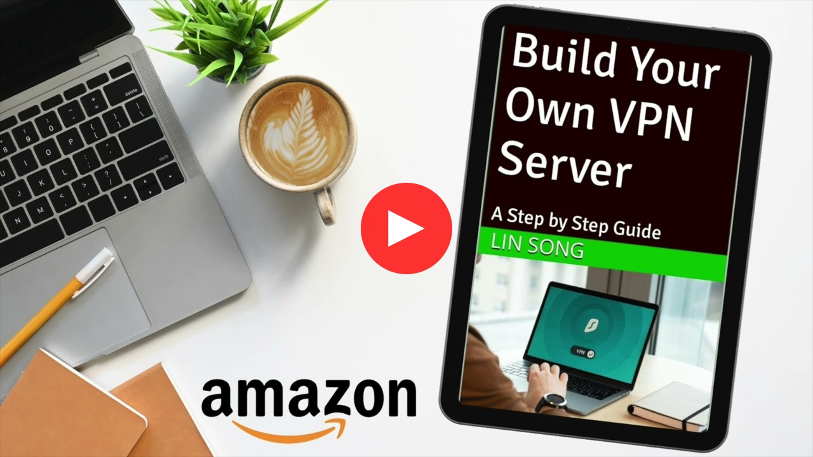

[&laquo; 返回主页](../README-zh.md) | [English](vpn-book.md) | [中文](vpn-book-zh.md)

# 搭建自己的 VPN 服务器分步指南

本书是搭建你自己的 IPsec VPN, OpenVPN 和 WireGuard 服务器的分步指南。在 [Amazon](https://amazon.com/author/linsong)、[Google Play](https://play.google.com/store/books/details?id=GMrDEAAAQBAJ) 和 [Apple Books](http://books.apple.com/us/book/id6449994515) 上提供电子书、有声读物和平装本格式。

本书有以下语言版本：[简体中文](https://books2read.com/vpnguidezh), [繁體中文](https://books2read.com/vpnguidezht), [English](https://books2read.com/vpnguide?store=amazon), [Español](https://books2read.com/vpnguidees?store=amazon), [Deutsch](https://books2read.com/vpnguidede?store=amazon), [Français](https://books2read.com/vpnguidefr?store=amazon), [Italiano](https://books2read.com/vpnguideit?store=amazon), [Nederlands](https://books2read.com/vpnguidenl?store=amazon), [Português](https://books2read.com/vpnguidept?store=amazon), [日本語](https://books2read.com/vpnguideja?store=amazon)。

你还可以在同一系列书籍中找到有关搭建 VPN 服务器的综合/完整指南。有以下语言版本：[简体中文](https://books2read.com/vpnzh), [繁體中文](https://books2read.com/vpnzht), [English](https://books2read.com/vpn?store=amazon), [Español](https://books2read.com/vpnes?store=amazon), [Deutsch](https://books2read.com/vpnde?store=amazon), [Français](https://books2read.com/vpnfr?store=amazon), [Italiano](https://books2read.com/vpnit?store=amazon), [日本語](https://books2read.com/vpnja?store=amazon)。

作者页面：https://amazon.com/author/linsong

## 介绍视频 (YouTube)

