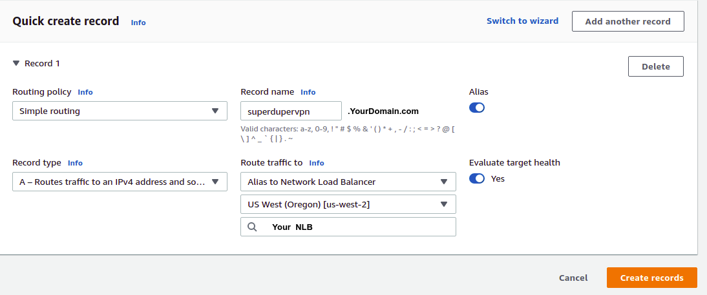
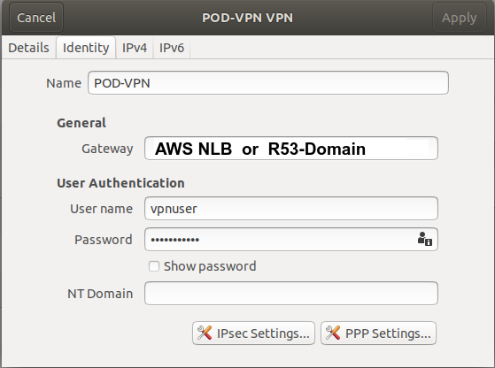
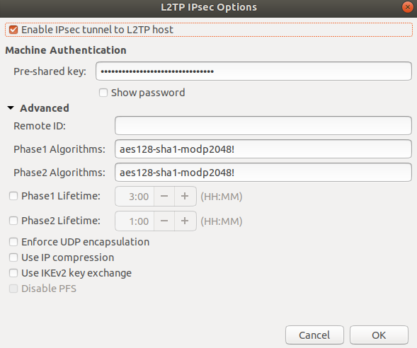

# VPN on Kubernetes Pod

### How to Run

<pre>
kubectl apply -f .
  namespace/vpn created
  deployment.apps/vpn created
  service/ipsec-vpn-server-aws-nlb created
</pre>

  
### Architecture

### R53

 

 

 

### Configure your system

 

  

### kubectl get all -n vpn

<pre>
NAME                                  READY   STATUS    RESTARTS   AGE
pod/vpn-7477d97f87-7jfvj              1/1     Running   0          28m

NAME                               TYPE           CLUSTER-IP    EXTERNAL-IP                  PORT(S)                                       AGE
service/ipsec-vpn-server-aws-nlb   LoadBalancer   5.5.5.5   	foobar.elb.z.amazonaws.com   500:32399/UDP,4500:31327/UDP,1701:31028/UDP   27m

NAME                             READY   UP-TO-DATE   AVAILABLE   AGE
deployment.apps/vpn              1/1     1            1           28m

NAME                                        DESIRED   CURRENT   READY   AGE
replicaset.apps/vpn-7477d97f87              1         1         1       28m
</pre>

### netcat 

<pre>
$ nc -vzu foobar.elb.z.amazonaws.com 500
Connection to oobar.elb.z.amazonaws.com 500 port [udp/isakmp] succeeded!

</pre>

### tcpdump -i eth0 udp (in the Pod)

<pre>
19:36:14.046396 IP 1-1-1-1.kubelet.kube-system.svc.cluster.local.55912 > vpn-7477d97f87-7jfvj.500: |isakmp|
19:36:14.046734 IP vpn-7477d97f87-7jfvj.50692 > kube-dns.kube-system.svc.cluster.local.53: 40024+ PTR? 2.2.2.2.in-addr.arpa. (44) 19:36:14.046895 IP kube-dns.kube-system.svc.cluster.local.53 > vpn-7477d97f87-7jfvj.50692: 40024*- 1/0/0 PTR 1-1-1-1.kubelet.kube-system.svc.cluster.local. (135)
19:36:14.046986 IP vpn-7477d97f87-7jfvj.39097 > kube-dns.kube-system.svc.cluster.local.53: 51793+ PTR? 3.3.3.3.in-addr.arpa. (42)
19:36:14.047109 IP kube-dns.kube-system.svc.cluster.local.53 > vpn-7477d97f87-7jfvj.39097: 51793*- 1/0/0 PTR kube-dns.kube-system.svc.cluster.local. (118)
19:36:14.050323 IP 1-1-1-1.kubelet.kube-system.svc.cluster.local.55912 > vpn-7477d97f87-7jfvj.500: |isakmp|
19:36:15.047801 IP 1-1-1-1.kubelet.kube-system.svc.cluster.local.55912 > vpn-7477d97f87-7jfvj.500: |isakmp|
19:36:16.047829 IP 1-1-1-1.kubelet.kube-system.svc.cluster.local.55912 > vpn-7477d97f87-7jfvj.500: |isakmp|
19:36:17.046943 IP 1-1-1-1.kubelet.kube-system.svc.cluster.local.55912 > vpn-7477d97f87-7jfvj.500: |isakmp|
</pre>

